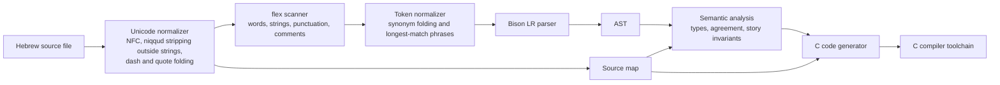
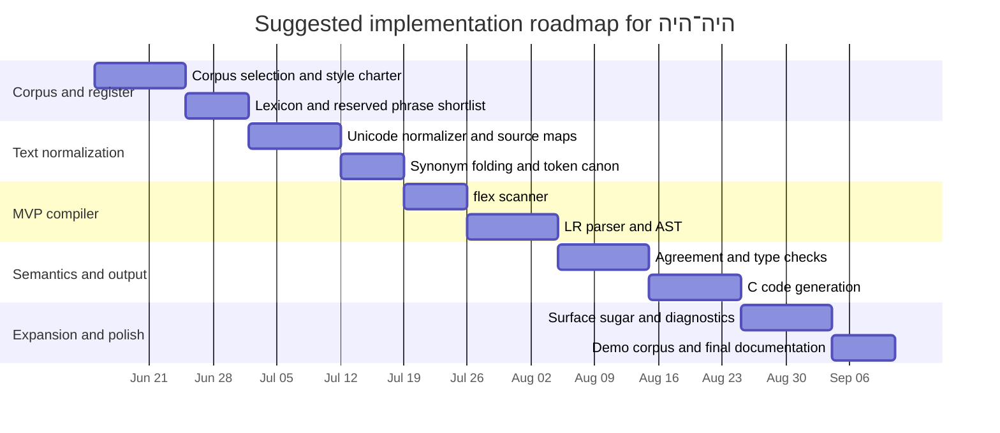

# Designing היה־היה as a Fairy-Tale Hebrew Programming Language

## Executive Summary

The strongest design direction for **היה־היה** is not “Codesh with different keywords,” but a **two-layer language**: a richly naturalistic fairy-tale surface, paired with a **small canonical core** that is easy to parse with LR-style machinery. Codesh is valuable precisely because it shows that a highly literary Hebrew syntax can be compiled at all: it is explicitly modeled on Biblical Hebrew, uses Hebrew-only vocabulary, maqaf-separated “bibli-case” identifiers, ritual file openers such as `בס"ד`, and a verb-first, colon-terminated style. But the public Hebrew fairy-tale corpus sounds different. In Hebrew fairy-tale translations and oral-tale transcriptions, the dominant entry points are oral formulas like `היה היה`, `היה היה פעם`, `פעם היה`, `פעם לפני שנים רבות`, and `יום אחד`; the dominant narrative engine is past-tense third-person storytelling; and dialogue is usually carried by modern tags such as `אמר`, `ענתה`, `קראה`, and `שאלה`, with occasional elevated flourishes like `ויהי היום` rather than full biblical imitation. citeturn23view0turn19view0turn19view1turn35view3turn35view1

For that reason, the best architecture is to let authors write several fairy-tale phrasings, but normalize them into a **compact token inventory** before parsing. This approach is not just aesthetically sensible; it is technically prudent. Flex historically assumes input is processed **one byte at a time**, and the W3C’s lex/UTF-8 note treats practical Unicode support as a matter of transcoding character patterns into byte patterns. On the parser side, the Bison manual is explicit that precedence declarations are the right tool for expression conflicts, that dangling-`else` shifts unless you structure the grammar carefully, and that overlapping nullable rules are a classic source of reduce/reduce errors. In other words: keep the fairy-tale richness in the **normalizer**, keep the parser grammar **small and explicit**, and use **block terminators** aggressively. citeturn28view0turn29view0turn31view0turn31view1turn31view2

A second key recommendation is to enforce **Hebrew grammaticality locally, not globally**. Full Hebrew natural-language correctness is well beyond a course compiler project. But you can enforce high-value, visible correctness in reserved constructions: `יהי` versus `תהי`, `ושמו` versus `ושמה`, `וערכו` versus `וערכה`, agreement between declared type words and surrounding syntax, correct use of vocatives in optional sugar, and story-level invariants such as exactly one tale-opening at the top and exactly one tale-closing at the end.

The corpus below is intentionally built from **Hebrew public-domain or official Hebrew-facing repositories**: Hebrew Wikisource, Project Ben-Yehuda, and the National Library of Israel. NLI explicitly frames fairy tales and translated tales as part of the formation of Hebrew children’s literature, including early Hebrew milestones such as `רמוצה` and David Frishman’s Andersen volume. That makes translated material a feature, not a compromise, for your project: the target register is not “ethnographically pure folklore,” but **Hebrew fairy-tale diction as Hebrew readers actually encountered it**. The target C dialect was not specified, so the generated C examples below use a portable **illustrative C99-like subset** only. citeturn38view2turn38view1turn38view0

## Corpus for a Hebrew Fairy-Tale Register

A practical corpus for language design should do three jobs at once: provide a large supply of fairy-tale formulas, expose different strata of Hebrew fairy-tale diction, and come from repositories stable enough that you can cite them in course documentation. The best starting combination is: **Hebrew Wikisource’s `ספר הפיות הכחול`** for a broad and relatively uniform modern-Hebrew fairy register; **Frishman’s Andersen corpus** for a prestigious early literary-Hebrew translation layer; and **Project Ben-Yehuda’s Jewish oral-tale collections plus Rivlin’s `אלף לילה ולילה`** for oral formulas, blessings, and wonder-tale idiom. NLI’s children’s-literature portal explicitly presents fairy tales and translated tales as cultural background-building material for Hebrew readers, which is exactly the role your planned language register will play. citeturn38view2turn15view0turn36view0turn17view0turn18view0

Hebrew Wikisource’s **`ספר הפיות הכחול`** identifies the corpus as a Hebrew translation of Andrew Lang’s 1889 *The Blue Fairy Book*, translated by **Ofer Waldman** and **Nahum Vengrov**. It lists a much larger TOC than the minimal category page alone, which makes it an excellent core lexical corpus. citeturn15view0

| Title | Publication / repository | Why it belongs in the seed corpus |
|---|---|---|
| `טבעת הארד` | Hebrew Wikisource, *ספר הפיות הכחול* | Courtly quest register; useful for object-centered syntax |
| `הנסיך יקינתון והנסיכה הקטנה` | Hebrew Wikisource, *ספר הפיות הכחול* | Royal-title density and ceremonial narration |
| `ממזרח לשמש וממערב לירח` | Hebrew Wikisource, *ספר הפיות הכחול* | Directional formulas and long quest motion |
| `הגמד הצהוב` | Hebrew Wikisource, *ספר הפיות הכחול* | Magical creature vocabulary |
| `כיפה אדומה` | Hebrew Wikisource, *ספר הפיות הכחול* | Repetition ladders and dialogue rhythm |
| `היפהפיה הנרדמת ביער` | Hebrew Wikisource, *ספר הפיות הכחול* | Blessings, curses, court announcer style |
| `סינדרלה, או נעל הזכוכית הקטנה` | Hebrew Wikisource, *ספר הפיות הכחול* | Household diction and narrator commentary |
| `אלאדין והמנורה המופלאה` | Hebrew Wikisource, *ספר הפיות הכחול* | Wonder-object and imperative command syntax |
| `סיפורו של נער שיצא ללמוד מהו פחד` | Hebrew Wikisource, *ספר הפיות הכחול* | Expository narration and idiomatic dialogue |
| `עוץ-לי-גוץ-לי` | Hebrew Wikisource, *ספר הפיות הכחול* | Naming formulas and secret-name motifs |
| `היפה והחיה` | Hebrew Wikisource, *ספר הפיות הכחול* | Polite address and affective register |
| `משרתת-העל` | Hebrew Wikisource, *ספר הפיות הכחול* | Task-completion phrasing |
| `מדוע הים מלוח` | Hebrew Wikisource, *ספר הפיות הכחול* | Etiological closure style |
| `החתול העילאי, או חתול במגפיים` | Hebrew Wikisource, *ספר הפיות הכחול* | Clever-agent language and boastful dialogue |
| `פליסיה וכד הציפורנים` | Hebrew Wikisource, *ספר הפיות הכחול* | Decorative poetic diction |
| `החתולה הלבנה` | Hebrew Wikisource, *ספר הפיות הכחול* | Wonder-palace vocabulary |
| `הנזל וגרטל` | Hebrew Wikisource, *ספר הפיות הכחול* | Children-in-danger phrasing |
| `שלגית ושושנית` | Hebrew Wikisource, *ספר הפיות הכחול* | Pair structures and rhythmic binomials |
| `רועת האווזים` | Hebrew Wikisource, *ספר הפיות הכחול* | Court hierarchy and truth-revelation formulas |
| `החייט הקטן והאמיץ` | Hebrew Wikisource, *ספר הפיות הכחול* | Boasting, counting, and contest language |

David Frishman’s **`הגדות וסיפורים מאת ה. אנדרסן`** is doubly important: NLI identifies it as a Hebrew children’s-literature milestone from **Warsaw, 1896**, and Project Ben-Yehuda preserves Frishman’s associated essay on Andersen and children’s literature. NLI’s own discussion of Andersen in Hebrew quotes Frishman’s wish to “create childhood” in Hebrew, which is directly relevant to your project goal of making a language that *sounds* like Hebrew fairy-tale storytelling rather than merely translating compiler keywords. citeturn38view1turn36view0turn36view1

| Title | Publication / repository | Why it belongs in the seed corpus |
|---|---|---|
| `בגדי המלך החדשים` | Frishman’s Andersen corpus, Warsaw 1896; Hebrew Wikisource / NLI context | Public proclamation and absurd-court diction |
| `הזמיר` | Frishman’s Andersen corpus, Warsaw 1896; Hebrew Wikisource / NLI context | Courtly lyric style and musical imagery |
| `בת-המלך על העדשה` | Frishman’s Andersen corpus, Warsaw 1896; Hebrew Wikisource / NLI context | Concise royal formulaism |
| `הארגז המעופף` | Frishman’s Andersen corpus, Warsaw 1896; Hebrew Wikisource / NLI context | Wonder-device lexicon and airborne motion |

Project Ben-Yehuda’s **`שבעים סיפורים וסיפור: מפי יהודי טוניסיה`** is especially valuable because it is not merely literary translation but an edited body of oral tales. Its introduction states that the volume includes **71 stories**, recorded in **1955–1965** in Israel from **13 storytellers** from Tunisian Jewish backgrounds, and published in **Jerusalem, 1970**. Alongside that oral-Jewish layer, Rivlin’s Hebrew **`אלף לילה ולילה`** gives you Arabic wonder-tale syntax in stately Hebrew translation. citeturn18view0turn17view0turn40search7turn40search4turn40search0turn41search1turn41search3turn42search0

| Title | Publication / repository | Why it belongs in the seed corpus |
|---|---|---|
| `אלף לילה ולילה: סיפור הסוחר והשד` | Y. Y. Rivlin, from Arabic; Project Ben-Yehuda / NLI catalog context | Bargain, vow, fate, and supernatural contract language |
| `אלף לילה ולילה: סיפור שלושת התפוחים` | Y. Y. Rivlin, from Arabic; Project Ben-Yehuda / NLI catalog context | Frame-tale and suspense narration |
| `אלף לילה ולילה: סיפור הדייג` | Y. Y. Rivlin, from Arabic; Project Ben-Yehuda / NLI catalog context | Wish/reward structure and nested tale openings |
| `בת-מלך ובן-מלך שמצאו זה את זה` | Dov Noy, *שבעים סיפורים וסיפור: מפי יהודי טוניסיה* | Royal-folktale opening and recognition scenes |
| `דג אסיר תודה` | Dov Noy, *שבעים סיפורים וסיפור: מפי יהודי טוניסיה* | Gratitude motif and compact oral-story syntax |
| `מזלו של עני` | Dov Noy, *שבעים סיפורים וסיפור: מפי יהודי טוניסיה* | Fate language, repetition, and oral parataxis |

If you want a **course-sized** working corpus, this 30-text set is already enough. It spans literary translation, oral formula, courtly wonder tale, domestic fairy tale, and Jewish folk epilogue. It also gives you enough style contrast to decide what should be **core syntax**, what should be **optional sugar**, and what should remain **lint-only register guidance**.

## Stylistic Findings from the Corpus

The public texts suggest a very clear register profile for a fairy-tale Hebrew language. The table below condenses the most reusable features.

| Feature | Evidence from the corpus | Design implication |
|---|---|---|
| Opening formulas | Oral-tale openings include `היה היה פעם שד`, `פעם היה חי מלך`, and `היה היה פעם זקן אלמן`; literary openings include `פעם היו מלך ומלכה` and `פעם לפני שנים רבות בכפר אחד חיה ילדה קטנה`. citeturn19view0turn19view1turn35view3turn9view2 | Reserve a small, rigid family of file-opening formulas. |
| Closing formulas | Recurrent endings include `חיו באושר ובנחת ימים רבים`, `חיו חיים טובים ומאושרים`, `חיו חיים טובים וארוכים`, `הלוואי כולנו כך`, and `מי יתן ונחיה גם אנחנו`. citeturn20view0turn20view1turn39view2 | Support multiple closers, but normalize them to one program-end token. |
| Connective phrases | `אז`, `ובכן`, `לא עבר זמן רב`, `באותו רגע`, `מייד`, and `כעבור` move stories through quick scene changes. citeturn35view0turn35view3turn39view1 | Great surface vocabulary for sequencing, assignment, and loop sugar. |
| Verb tense and aspect | Narration is predominantly simple past (`הלך`, `בא`, `ראה`, `קרא`), with direct imperatives in speech (`תני לי`, `משכי`, `הביאי`). Elevated `ויהי היום` appears as a marked flourish, not the default narrative engine. citeturn35view2turn35view3turn35view0 | Keep the core grammar in modern/oral past-tense storytelling; treat biblical forms as optional stylistic sugar. |
| Narrative voice | The narrator is usually third-person and omniscient, but often intrudes evaluatively: `הנערה המסכנה`, or generalizes, as in `נסיך צעיר ומאוהב תמיד יהיה אמיץ`. citeturn35view2turn35view3 | A narrator-flavored language can justify performative verbs like `אמור` and `ספר`, but free commentary should remain outside the formal grammar. |
| Sentence texture | Openers tend to be short and formulaic, while descriptive exposition expands into longer paratactic clauses joined by `ו`, `אך`, `אז`, and explanatory `כי`. In a small manual sample from Lang and Noy texts, opening sentences clustered in the low-to-mid teens in word count, while scene-setting sentences often ran into the high teens or twenties. citeturn35view1turn35view3turn35view0turn41search1turn41search3 | Good syntax should be concise in the core, but allow longer surface phrasings to normalize into the same AST. |
| Repetition | `כיפה אדומה` uses the famous ladder of repeated questions and answers, while `היפהפיה הנרדמת` accumulates sequential fairy gifts and predictions. citeturn24view3turn35view3 | Loops and branches should allow rhythmically repeated phrasing. |
| Vocatives | Common address forms include `אבי היקר`, `חביבתי`, `ילדתי`, and `אדוני`. citeturn35view1turn35view3turn39view1turn39view3 | Vocatives are excellent optional sugar around I/O and function calls, but too free-form for the MVP grammar core. |
| Poetic devices | The corpus repeatedly uses rhythmic binomials and intensifiers such as `צרות צרורות`, `עושר וכבוד`, and `חיים טובים וארוכים`. citeturn19view0turn39view2 | Keep them in the lexical synonym pool, not as distinct grammar productions. |

A crucial stylistic consequence follows from the corpus mix: **fairy-tale Hebrew is formulaic, but not uniform**. The same story world can sound orally compact (`היה היה דייג...`) or literary-elevated (`ויהי היום...`). That suggests a language design with **two surface bands**: an **oral-neutral band** for the MVP and a **courtly-elevated band** that normalizes into the same internal tokens later.

The lexicon below is therefore a **design lexicon** rather than a strict corpus-frequency table. It is synthesized from recurring formulas in the Hebrew Wikisource fairy corpus, Frishman’s Andersen layer, Noy’s oral-tale collection, and Rivlin’s wonder-tale translations. citeturn15view0turn36view0turn18view0turn17view0

| Narrative role | Working lexicon for היה־היה | Best reserved subset |
|---|---|---|
| Opening formulas | `היה היה`, `היה היו`, `היה היה פעם`, `פעם היה`, `פעם אחת היה`, `בימים ההם`, `יום אחד`, `ויהי היום`, `מעשה שהיה`, `פעם לפני שנים רבות` | `היה היה פעם`, `פעם אחת היה` |
| Time cues | `אז`, `ואז`, `בינתיים`, `לא עבר זמן רב`, `כעבור זמן`, `למחרת`, `בלילה ההוא`, `עם שחר`, `עד חצות`, `באותו רגע` | `אז`, `באותו רגע`, `לא עבר זמן רב` |
| Place cues | `בממלכה רחוקה`, `בארץ רחוקה`, `בכפר אחד`, `בעיר אחת`, `ביער`, `בארמון`, `בבקתה`, `על שפת הים`, `בראש המגדל`, `בקצה הדרך` | `בממלכה רחוקה`, `בכפר אחד` |
| Social roles | `מלך`, `מלכה`, `בן־מלך`, `בת־מלך`, `נסיך`, `נסיכה`, `עני`, `עשיר`, `דייג`, `סנדלר` | `מלך`, `נסיכה`, `דייג` |
| Family and address | `אבא`, `אבי היקר`, `אמי`, `בני`, `בתי`, `ילדתי`, `יקירתי`, `חביבתי`, `אדוני`, `הוד מלכותך` | `אדוני`, `ילדתי`, `אבי היקר` |
| Speech verbs | `אמר`, `אמרה`, `ענה`, `ענתה`, `שאל`, `שאלה`, `קרא`, `קראה`, `לחשה`, `ציווה` | `אמר`, `ענתה`, `קרא` |
| Commands | `אמור`, `ספר`, `השמע`, `הבא`, `קח`, `לך`, `שובי`, `רוץ`, `שמור`, `המתן` | `אמור`, `ספר`, `הבא` |
| Motion and transition | `יצא`, `הלך`, `בא`, `שב`, `חזר`, `נכנס`, `עלה`, `ירד`, `המשיך`, `נעלם` | `הלך`, `בא`, `חזר` |
| Connectives and cause | `אך`, `אולם`, `ולכן`, `משום כך`, `ואילו`, `ואף על פי כן`, `עד אשר`, `כי`, `מפני ש`, `כדי ש` | `אך`, `ולכן`, `כי`, `כדי ש` |
| Condition and comparison | `אם`, `ואם לא`, `אחרת`, `כל עוד`, `כל זמן ש`, `גדול מ`, `קטן מ`, `שווה ל`, `יותר מ`, `פחות מ` | `אם`, `ואם לא`, `כל עוד`, `גדול מ`, `קטן מ`, `שווה ל` |
| Emotion and evaluation | `שמח`, `בכה`, `נבהל`, `פחד`, `כעס`, `רחם`, `אהב`, `יפה`, `טוב`, `מסכן` | `שמח`, `פחד`, `מסכן` |
| Magic and fate | `פיה`, `שד`, `גמד`, `קסם`, `כישוף`, `ברכה`, `קללה`, `חלום`, `גורל`, `נס` | `קסם`, `ברכה`, `קללה`, `נס` |
| Trial and reward | `מבחן`, `משאלה`, `חצי המלכות`, `אוצר`, `זהב`, `יהלומים`, `הצלה`, `ישועה`, `שכר`, `עונש` | `משאלה`, `חצי המלכות`, `אוצר`, `שכר` |
| Repetition and rhythm | `טוק טוק`, `מי שם`, `שוב ושוב`, `שלוש פעמים`, `שבע שנים`, `מאה שנים`, `צרות צרורות`, `טובים ומאושרים`, `עושר וכבוד`, `חיים טובים וארוכים` | `שוב ושוב`, `שלוש פעמים`, `טוק טוק` |
| Closings and blessings | `לבסוף`, `בסוף`, `מאז`, `ומאז`, `עד סוף ימיהם`, `חיו באושר ובעושר`, `חיו באושר ובנחת`, `הלוואי כולנו כך`, `מי יתן ונחיה גם אנחנו`, `תם ונשלם` | `תם ונשלם`, `וכאן תם הסיפור`, `וזה סוף המעשה` |

The design lesson is straightforward: your grammar should not try to “parse all 150 items.” Instead, choose a **canonical subset of about 25–35 reserved forms**, and let the rest fuel a **synonym table**, **pretty-printer**, and **style-lint suggestions**.

## Surface Syntax and Grammar Proposal

Codesh is the right inspiration in one very specific sense: it proves that **Hebrew-only language design** can be coherent and distinctive. Its page foregrounds Hebrew vocabulary, maqaf-based identifier style, devotional openers, verb-first phrasing, and deliberate verbosity. For **היה־היה**, though, only some of that should survive. The table below summarizes the should-borrow versus should-not-borrow split. citeturn23view0turn35view3turn19view0

| Codesh-like feature | Recommendation for היה־היה | Reason |
|---|---|---|
| Hebrew-only keywords | Keep | This is central to identity and fully compatible with your goal |
| Maqaf-separated identifiers | Keep, but soften them into fairy-tale naming | `שעון־חצות`, `בן־המלך`, `שלוש־נקישות` are readable and Hebrew-native |
| Ritual header like `בס"ד` | Avoid by default | Too devotional and too specifically Codesh/Biblical in register |
| Full Biblical VSO syntax | Avoid | Fairy-tale Hebrew in the corpus is mostly oral/modern prose, not scriptural imitation |
| Colon after every statement | Avoid | Prose-style period works better; keep `:` for block introducers only |
| Ultra-verbose filler words with no semantic payload | Use very sparingly | A little ornament is charming; too much will harm both parsing and readability |
| Special string-literal syntax instead of quotes | Avoid in MVP | Fairy-tale register does not need this complication; plain quoted strings are better |
| Number words as the only numeral form | Delay to a later phase | Great as sugar, poor as an MVP dependency |

The following table proposes **multiple naturalistic templates** for each core construct. The important design move is to select **one parser-friendly canonical form** and treat the others as **surface variants** normalized into the same token stream.

| Construct | Naturalistic alternatives | Parsing and naturalness analysis | Recommended MVP form |
|---|---|---|---|
| Program start | `היה היה פעם סיפור ושמו <שם>.` / `פעם אחת היה מעשה ושמו <שם>.` / `פעם היה סיפור ושמו <שם>.` / `זה סיפורו של <שם>.` | The first three are easy to recognize by rigid formula; `זה סיפורו של` is elegant but more clause-like and easier to confuse with normal prose. | `היה היה פעם סיפור ושמו <שם>.` |
| Program end | `תם ונשלם.` / `וכאן תם הסיפור.` / `וזה סוף המעשה.` / `עד כאן המעשה.` | Neutral closers are safer than always forcing a happy ending; even the Hebrew *ספר הפיות הכחול* warns that not all stories end happily. citeturn15view0 | `תם ונשלם.` |
| Variable declaration | `יהי מספר ושמו מונה וערכו 0.` / `היה מספר אחד ושמו מונה, וערכו 0.` / `תהי מחרוזת ושמה ברכה וערכה "שלום".` / `פעם היה מספר ושמו מונה.` | The forms with `יהי/תהי` plus `ושמו/ושמה` expose agreement nicely. The existential `היה מספר אחד` is natural but less regular. | `יהי/תהי <טיפוס> ושמו/ושמה <שם> [וערכו/וערכה <ביטוי>].` |
| Assignment | `וישתנה מונה ויהי 3.` / `מעתה מונה הוא 3.` / `שנה את מונה ושים אותו 3.` / `החלף את מונה ב־3.` | `וישתנה ... ויהי ...` is the most fairy-tale-like and structurally rigid. The others are readable but more syntactically diverse. | `וישתנה <שם> ויהי <ביטוי>.` |
| Print / output | `אמור את <ביטוי>.` / `ספר את <ביטוי>.` / `השמע את <ביטוי>.` / `ויאמר המספר את <ביטוי>.` | `אמור` is short and clean. `ספר` and `השמע` are excellent synonyms. The explicit subject in `ויאמר המספר` is flavorful but syntactically noisier. | `אמור את <ביטוי>.` |
| Condition | `אם <תנאי> אז:` / `אם אמת היא כי <תנאי> אז:` / `ואם היה <תנאי>:` / `כלום <תנאי>? אם כן:` | The first is the clearest. The others are attractive surface sugar, but should desugar before parsing. | `אם <תנאי> אז:` |
| Loop | `כל עוד <תנאי>:` / `כל זמן ש־<תנאי>:` / `שוב ושוב, כל עוד <תנאי>:` / `כל הימים אשר <תנאי>:` | `כל עוד` is modern, simple, and distinct. `כל זמן ש` can normalize cleanly as a synonym. | `כל עוד <תנאי>:` |
| Function | `מעשה ושמו <שם> המקבל ...:` / `סיפורון ושמו <שם> המקבל ...:` / `יהי מעשה ושמו <שם>, המקבל ...:` / `מעשהו של <שם>, המקבל ...:` | `מעשה ושמו` is the best bridge between fairy register and parser clarity. `סיפורון` is charming sugar for later. | `מעשה ושמו <שם> המקבל ...:` |

A small built-in type inventory is enough for the MVP:

| Type word | Meaning | Grammatical gender | Illustrative C mapping |
|---|---|---|---|
| `מספר` | integer | masculine | `int` |
| `מחרוזת` | string/text | feminine | `const char *` |
| `מצב` | boolean | masculine | `int` or `_Bool` |
| `רשימה` | list/array later | feminine | runtime struct |

To keep the parser small, I would explicitly normalize surface forms into token families before Bison sees them.

| Canonical token | Surface forms collapsed into it |
|---|---|
| `STORY_OPEN` | `היה היה פעם סיפור ושמו`, `פעם אחת היה מעשה ושמו`, `פעם היה סיפור ושמו` |
| `STORY_CLOSE` | `תם ונשלם`, `וכאן תם הסיפור`, `וזה סוף המעשה`, `עד כאן המעשה` |
| `DECL_M` | `יהי`, `יהא`, `יהיה` |
| `DECL_F` | `תהי`, `תהא`, `תהיה` |
| `NAME_M` | `ושמו` |
| `NAME_F` | `ושמה` |
| `INIT_M` | `וערכו`, `שערכו` |
| `INIT_F` | `וערכה`, `שערכה` |
| `ASSIGN` | `וישתנה`, `החלף את`, `שנה את` |
| `SAY` | `אמור`, `ספר`, `השמע`, `ויאמר` |
| `IF` | `אם`, `אם אמת היא כי` |
| `ELSE` | `ואם לא`, `אחרת`, `ואם לא כן` |
| `WHILE` | `כל עוד`, `כל זמן ש`, `כל הימים אשר` |
| `FUNC` | `מעשה ושמו`, `סיפורון ושמו` |
| `RETURN` | `השב`, `החזר` |
| `CALL` | `הפעל`, `קרא ל`, `עשה` |
| `ARGSEP` | `עם`, `ועם`, `וגם` |
| `GT / LT / EQ` | `גדול מ`, `קטן מ`, `שווה ל` |
| `PLUS / MINUS / TIMES / DIV` | `ועוד`, `פחות`, `כפול`, `חלקי` |

A parser-friendly EBNF sketch can then remain pleasantly small:

```ebnf
program        = story_open, { top_item }, story_close ;

top_item       = func_decl | stmt ;

story_open     = STORY_OPEN, identifier, "." ;
story_close    = STORY_CLOSE, "." ;

stmt           = decl_stmt, "."
               | assign_stmt, "."
               | say_stmt, "."
               | if_stmt
               | while_stmt
               | return_stmt, "."
               | expr_stmt, "."
               ;

decl_stmt      = decl_intro, type_name, name_link, identifier,
                 [ init_link, expr ] ;

decl_intro     = DECL_M | DECL_F ;
name_link      = NAME_M | NAME_F ;
init_link      = INIT_M | INIT_F ;

assign_stmt    = ASSIGN, identifier, BECOME, expr
               | identifier, BECOME, expr
               ;

say_stmt       = SAY, [ OBJ_MARK ], expr ;

if_stmt        = IF, expr, THEN, ":", block,
                 [ ELSE, ":", block ],
                 END_IF, "." ;

while_stmt     = WHILE, expr, ":", block, END_WHILE, "." ;

func_decl      = FUNC, identifier,
                 [ TAKES, param_list ],
                 [ RETURNS, type_name ],
                 ":", block, END_FUNC, "." ;

param_list     = param, { ARGSEP, param } ;
param          = type_name, name_link, identifier ;

return_stmt    = RETURN, [ OBJ_MARK ], expr ;
expr_stmt      = call_expr ;

block          = { stmt } ;

expr           = or_expr ;
or_expr        = and_expr, { OR, and_expr } ;
and_expr       = cmp_expr, { AND, cmp_expr } ;
cmp_expr       = add_expr, [ cmp_op, add_expr ] ;
cmp_op         = GT | LT | GE | LE | EQ | NE ;
add_expr       = mul_expr, { (PLUS | MINUS), mul_expr } ;
mul_expr       = unary_expr, { (TIMES | DIV), unary_expr } ;
unary_expr     = [ NOT | MINUS ], primary ;

primary        = NUMBER
               | STRING
               | TRUE
               | FALSE
               | identifier
               | call_expr
               | "(", expr, ")"
               ;

call_expr      = CALL, identifier, [ WITH, arg_list ] ;
arg_list       = expr, { ARGSEP, expr } ;

type_name      = TYPE_NUMBER | TYPE_STRING | TYPE_BOOL | TYPE_LIST ;
identifier     = HEBREW_IDENTIFIER ;
```

If you translate that into a Bison grammar, the standard precedence stack should be enough:

```bison
%left OR
%left AND
%nonassoc GT LT GE LE EQ NE
%left PLUS MINUS
%left TIMES DIV
%right NOT UMINUS
```

The most important LR(1) notes are structural, not poetic. First, avoid the classic dangling-`else` class of ambiguity by using **explicit end markers** such as `סוף אם` and keeping `ELSE` inside the single `if_stmt` production. Second, keep overlapping empty productions to a minimum; Bison’s own examples on reduce/reduce conflicts are a direct warning against letting multiple list-like nonterminals all derive empty in related contexts. Third, keep **assignment out of the expression grammar** for the MVP. That one choice removes a huge amount of unnecessary precedence complexity. citeturn31view0turn31view1turn31view2

## Lexer, Semantics, and Implementation Plan

For a Hebrew UTF-8 language built with **flex**, the core engineering decision should be: **normalize first, lex second, fold phrases third, parse fourth**. Flex’s FAQ states bluntly that its longstanding assumption is byte-at-a-time processing, and that naïvely assuming multi-byte characters “just work” is misplaced. The W3C’s lex/UTF-8 note describes the practical workaround as mapping Unicode character patterns into byte patterns. Unicode normalization exists precisely to give equivalent strings a unique binary representation; the Unicode core spec for Hebrew treats niqqud and pronunciation points as combining marks; and the Bidirectional Algorithm specifies that text remains in **logical order** internally while display order changes only for presentation. So the compiler should normalize to a canonical Unicode form before lexing, strip or reject presentation-only clutter outside string literals, and store source internally in logical order throughout the pipeline. citeturn28view0turn29view0turn33search0turn33search8turn34search7turn34search1

The most practical pipeline is this:

| Pipeline layer | Recommendation | Why |
|---|---|---|
| Unicode pre-normalizer | Normalize source to NFC; strip niqqud and cantillation **outside string literals**; fold quote variants and dash variants into a canonical form; reject bidi control characters outside strings/comments; preserve line/column source maps | Avoids visually-equal but byte-different tokens; reduces lexer complexity dramatically |
| flex scanner | Tokenize **words**, numbers, punctuation, string literals, comments, and raw Hebrew identifiers; do not try to encode every fairy-tale phrase in regexes | Keeps flex’s job byte-friendly and maintainable |
| Token-stream normalizer | Greedily fold multiword phrases into canonical tokens using a longest-match synonym trie: e.g. `פעם אחת היה מעשה ושמו` → `STORY_OPEN` | Prevents grammar explosion from surface synonyms |
| Bison parser | Consume canonical tokens only | Makes the grammar LR-friendly |
| Semantic pass | Enforce agreement, typing, and story invariants | Keeps “Hebrew correctness” where it is most visible |
| C generator | Emit portable ASCII-safe C identifiers by mangling Hebrew names and preserving Hebrew string literals | Avoids relying on compiler support for Unicode C identifiers |

Flex’s **start conditions** are especially useful here. Its manual recommends them explicitly for “mini-scanners,” comments, and quoted strings, and shows how exclusive start states simplify these syntactically distinct regions. That means you should absolutely use start conditions for at least `STRING`, `COMMENT`, and optionally `RAW_TEXT` if you later introduce interpolated fairy speech or doc-comment blocks. citeturn43view0

The key strategy for “multiple synonymous phrasings without exploding the grammar” is best summarized this way:

| Strategy | Pros | Cons | Verdict |
|---|---|---|---|
| Put every synonym directly into the grammar | Surface transparency | State growth, conflict risk, unreadable grammar | Avoid for anything beyond 1–2 trivial variants |
| Canonicalize in the lexer/token normalizer | Compact grammar, predictable parsing, easy precedence handling | Requires source-map preservation for diagnostics | **Recommended default** |
| Pre-parse macro/desugaring layer | Excellent for highly poetic sugar like `כלום ...? אם כן` | Adds another syntax layer and another place for bugs | Use later for advanced surface mode |

Semantic checking should carry much of the “correct Hebrew” burden. A good first semantic pass would include the following:

| Semantic check | Example of what it catches | Error or warning style |
|---|---|---|
| Gender agreement in declarations | `תהי מספר ושמה מונה וערכה 3.` | Error: feminine frame around masculine type `מספר` |
| Agreement in name/value links | `יהי מצב ושמה אמיץ.` | Error: `ושמה` does not agree with masculine declaration |
| Type correctness | `אם 7 אז:` | Error: condition must be boolean |
| Identifier legality | spaces inside names, reserved words reused as identifiers, malformed maqaf runs | Error: illegal fairy-name |
| Function arity | `הפעל כפול עם 1 וגם 2` when `כפול` takes one parameter | Error: wrong number of gifts to the deed |
| Return coverage | function with some branch not returning | Error: not every path reaches `השב` |
| Story-level invariants | second `היה היה פעם ...` in the middle of the file; code after `תם ונשלם.` | Error: tale opener/closer out of place |
| Register lint | mixing a very biblical surface with strongly colloquial modern sugar in one rigid statement | Warning, not error |
| Happy-ending lint | forcing `חיו באושר ובעושר` on programs that do not conceptually “end happily” | Warning: prefer neutral closer for non-epilogue code |

Two semantic policies are especially important for scope control. First, **enforce agreement only where the language owns the words**: declarations, block openers, return forms, and closers. Second, **do not attempt free adjective-noun agreement** in arbitrary user prose inside strings or comments. Compiler-enforced Hebrew should be reserved for the language’s *formal templates*, not for all possible Hebrew.

A good course-project architecture would look like this:



The phased implementation plan below assumes no externally imposed deadline and is therefore **notional**, but it is realistic for a semester project.

| Phase | Main deliverables | Exit criteria |
|---|---|---|
| Corpus and style charter | 30-text seed corpus, lexicon, reserved-form shortlist, style guide | You can justify every reserved phrase from the corpus |
| Unicode and token normalization | NFC normalizer, niqqud stripping policy, source maps, synonym dictionary | Equivalent fairy forms produce identical canonical tokens |
| MVP lexer and parser | flex scanner, canonical token stream, parser for declarations, assignment, print, if, while | 8–10 positive programs parse with zero conflicts or with explicitly justified ones |
| AST and C generation | Type nodes, statement nodes, C emitter, name mangling | End-to-end compile-run for simple numeric/string examples |
| Semantic Hebrew checks | Gender agreement, type checks, story invariants, better diagnostics | Negative tests fail with intelligible Hebrew-aware errors |
| Surface-sugar expansion | Additional opener/closer synonyms, oral/courtly variants, prettier messages | Multiple phrasings normalize to the same AST |
| Polish and documentation | Demo corpus, README, grammar appendix, examples for course submission | One-click demo from Hebrew source to C output |

A sensible unit-test matrix would include at least the following:

| Unit-test family | Example test | Expected result |
|---|---|---|
| Unicode normalization | Pointed and unpointed forms of the same keyword | Same canonical token stream |
| Dash normalization | `בן-מלך` vs `בן־מלך` in identifiers | Same identifier token |
| Synonym folding | `היה היה פעם` vs `פעם אחת היה` | Same `STORY_OPEN` token |
| Declaration agreement | `יהי מספר ושמה מונה` | Semantic error |
| Block structure | missing `סוף אם.` | Parser error with expected closer |
| Else binding | nested `אם` with `ואם לא` | Deterministic parse or explicit rejection by style rules |
| Expression precedence | `1 ועוד 2 כפול 3` | AST groups as `1 + (2 * 3)` |
| Name mangling | Hebrew identifier in source | Stable ASCII-safe symbol in generated C |
| Codegen snapshot | `אמור את "שלום".` | Stable emitted C file |
| End-to-end runtime | `שלוש־נקישות` loop example | Executable prints the expected lines |

A ten-week notional roadmap could look like this:



## Test Corpus and Sample Generated C

Because the target C dialect was not specified, the examples below use a deliberately conservative, illustrative subset of C. The generated C assumes that Hebrew source identifiers are **mangled** into ASCII-safe C symbols, while Hebrew string literals remain UTF-8 text.

A compact but high-coverage **seed program corpus** for testing should include at least the following 12 examples:

| Program name | Hebrew idea | Features under test |
|---|---|---|
| `שלום־הממלכה` | prints a greeting | story open/close, string literal, output |
| `מונה־התפוחים` | declares and prints a number | declaration, initialization, output |
| `אם־הנסיך־אמיץ` | chooses between two branches | boolean type, if/else |
| `שלוש־נקישות` | prints `טוק` three times | while loop, arithmetic assignment |
| `המתנה־הכפולה` | defines and calls a function | function decl, return, call |
| `סוד־השם` | shows string assignment | string declaration and reassignment |
| `שבע־המדרגות` | nested loop/branch | nesting and block closure |
| `שומר־הסף` | comparison against threshold | relational operators |
| `הפיה־והמשאלה` | multiple calls with parameters | arity and expression lists |
| `מגדל־הזמן` | loop until `חצות` counter | comparison plus repeated assignment |
| `פתח־המערה` | uses synonyms for open/close/print | lexical canonicalization |
| `סוף־טוב` | neutral close versus happy-close variants | closer normalization and style lint |

Five worked examples follow. These examples all use the **recommended canonical MVP subset** rather than the full synonym-rich surface.

**Example one**

Source in היה־היה:

```text
היה היה פעם סיפור ושמו שלום־הממלכה.
אמור את "שלום, ממלכה!".
תם ונשלם.
```

Illustrative generated C:

```c
#include <stdio.h>

int main(void) {
    puts("שלום, ממלכה!");
    return 0;
}
```

This is the minimal end-to-end compilation path: opener, output, closer.

**Example two**

Source in היה־היה:

```text
היה היה פעם סיפור ושמו מונה־התפוחים.
יהי מספר ושמו מונה וערכו 3.
אמור את מונה.
תם ונשלם.
```

Illustrative generated C:

```c
#include <stdio.h>

int main(void) {
    int v_mone = 3;
    printf("%d\n", v_mone);
    return 0;
}
```

This tests masculine declaration agreement, initialization, and numeric output.

**Example three**

Source in היה־היה:

```text
היה היה פעם סיפור ושמו אם־הנסיך־אמיץ.
יהי מצב ושמו אמיץ וערכו אמת.
אם אמיץ אז:
    אמור את "פתחו את השער".
ואם לא:
    אמור את "סגרו את השער".
סוף אם.
תם ונשלם.
```

Illustrative generated C:

```c
#include <stdio.h>

int main(void) {
    int v_amitz = 1;
    if (v_amitz) {
        puts("פתחו את השער");
    } else {
        puts("סגרו את השער");
    }
    return 0;
}
```

This is the cleanest branch template for the MVP because it avoids dangling ambiguity and keeps the condition boolean.

**Example four**

Source in היה־היה:

```text
היה היה פעם סיפור ושמו שלוש־נקישות.
יהי מספר ושמו מונה וערכו 0.
כל עוד מונה קטן מ 3:
    אמור את "טוק".
    וישתנה מונה ויהי מונה ועוד 1.
סוף כל עוד.
תם ונשלם.
```

Illustrative generated C:

```c
#include <stdio.h>

int main(void) {
    int v_mone = 0;
    while (v_mone < 3) {
        puts("טוק");
        v_mone = v_mone + 1;
    }
    return 0;
}
```

This shows how a fairy-tale loop can stay natural in Hebrew while lowering cleanly to ordinary imperative control flow.

**Example five**

Source in היה־היה:

```text
היה היה פעם סיפור ושמו המתנה־הכפולה.
מעשה ושמו כפול המקבל מספר ושמו x:
    השב את x כפול 2.
סוף מעשה.
יהי מספר ושמו מתנה וערכו הפעל כפול עם 7.
אמור את מתנה.
תם ונשלם.
```

Illustrative generated C:

```c
#include <stdio.h>

static int f_kaful(int p_x) {
    return p_x * 2;
}

int main(void) {
    int v_matana = f_kaful(7);
    printf("%d\n", v_matana);
    return 0;
}
```

This example is important because it demonstrates the whole design philosophy: the surface is fairy-tale Hebrew, but the semantic core is a straightforward typed function and expression language.

Taken together, these examples suggest a disciplined implementation strategy: keep the outward language charming, formulaic, and recognizably fairy-tale, but make the internal compiler pipeline **boringly deterministic**. That combination is the best way to build a language that feels like **היה־היה** while still surviving a real LR parser, a real flex lexer, and a real course deadline.